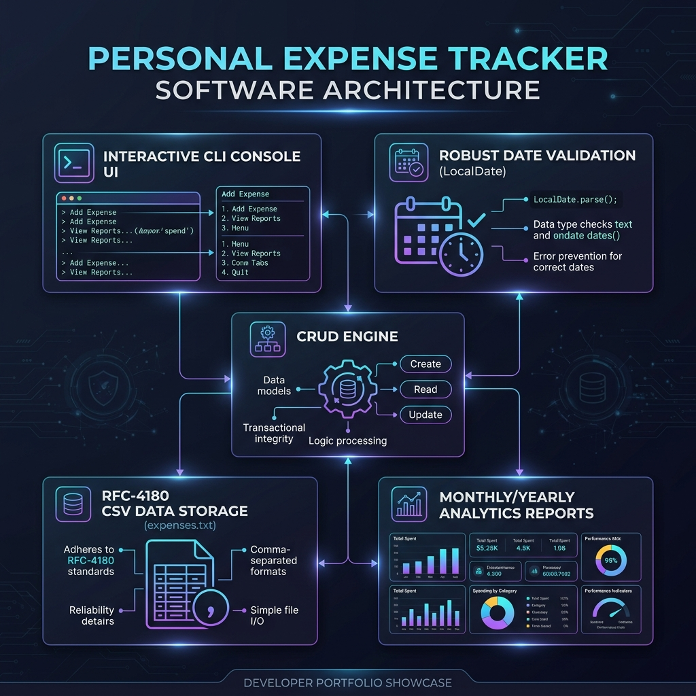

# 📊 Java Personal Expense Tracker

[](https://www.oracle.com/java/)
[](LICENSE)
[](https://github.com/yourusername/Java-Expense-Tracker/pulls)

A high-performance, command-line personal finance manager built in Java. This application helps users efficiently track daily expenses, perform statistical analytics, and persist records in a structured local database file. It has been refactored for clean code standards, robustness, and visual elegance.

---

## 🔍 Project Overview

The tracker is designed for users who want a quick, distraction-free, and robust command-line interface (CLI) to monitor their spending habits. It includes full input validation, chronological sorting, data summaries (monthly and yearly), and standard-compliant CSV serialization.



---

## ✨ Core Features

- **🎨 Colorized Console UI**: Uses ANSI escape sequences to provide visual cues (green for success, red for errors, cyan/blue for menus and borders).
- **📅 Smart Date Validator**: Uses Java's modern `java.time.LocalDate` engine for strict chronological validation (handles leap years, differing month lengths, and date formatting errors).
- **📋 Perfect Grid Alignment**: Displays your expense lists in a beautiful ASCII table using columnar formatting instead of unreliable tab stops. Includes smart text truncation to keep tables neat.
- **💾 Safe CSV Storage**: Implements an RFC 4180-compliant custom CSV engine. Commas and quotes in category or description fields are automatically escaped and quoted, preventing data corruption when reloading records.
- **📈 Analytical Reporting**: Generate instant statistical summaries:
  - Total accumulated expenses.
  - **Monthly Summary**: Aggregate expenses grouped chronologically by month.
  - **Yearly Summary**: Aggregate expenses grouped by year.
- **⚡ Advanced Views**: Filter by category, view highest expenses, search by specific date, and display expenses sorted by amount.

---

## 🛠️ Installation & Getting Started

### Prerequisites
- **Java Development Kit (JDK) 17** or higher.
- A terminal supporting ANSI color codes (standard on macOS, Linux, and Windows Terminal/PowerShell).

### Steps to Run
1. **Clone the repository**:
   ```bash
   git clone https://github.com/yourusername/Java-Expense-Tracker.git
   cd Java-Expense-Tracker
   ```

2. **Compile the source code**:
   ```bash
   javac Expense_Tracker.java
   ```

3. **Run the application**:
   ```bash
   java Expense_Tracker
   ```

---

## 🖥️ Interactive Console Demo

When you run the application, you'll be greeted with a polished colored console interface:

```ansi
********* Personal Expense Tracker *********
1. Add Expense
2. View Expenses
3. Edit Expense
4. Delete Expense
5. Calculate Total Expenses
6. View Summary Report
7. Exit
Enter your choice:- 2
```

### Table View Sample
```ansi
=================================== Expense List ==================================
+-----+------------+------------+--------------------+--------------------+--------------------------------+
| No. | Date       | Amount     | Category           | Payment Mode       | Description                    |
+-----+------------+------------+--------------------+--------------------+--------------------------------+
| 1   | 2026-05-01 | Rs.1500.00 | Food               | Credit Card        | Dinner with family             |
| 2   | 2026-05-15 | Rs.350.50  | Transport          | Cash               | Metro pass recharge            |
| 3   | 2026-05-20 | Rs.2450.00 | Entertainment      | Debit Card         | "Movie tickets, snacks"        |
+-----+------------+------------+--------------------+--------------------+--------------------------------+
```
*(Notice how descriptions containing commas like `"Movie tickets, snacks"` are safely wrapped in double quotes in the storage layer).*

---

## 📂 Project Structure

```
Java-Expense-Tracker/
│
├── assets/
│   └── overview.png          # High-resolution conceptual project diagram
│
├── .gitignore                # Configured to ignore compiled files & runtime data
├── Expense_Tracker.java      # Main executable file containing app logic & classes
└── README.md                 # Project showcase (this file)
```

---

## 💾 Storage Mechanics (`expenses.txt`)

Data is persisted locally in `expenses.txt` using RFC-4180 CSV standard layout.
```csv
2026-05-01,1500.0,Food,Credit Card,Dinner with family
2026-05-15,350.5,Transport,Cash,Metro pass recharge
2026-05-20,2450.0,Entertainment,Debit Card,"Movie tickets, snacks"
```
Because the storage parser is robust, commas within user descriptions do not corrupt file boundaries upon reload.

---

## 📄 License

This project is licensed under the MIT License - see the [LICENSE](LICENSE) file for details.
